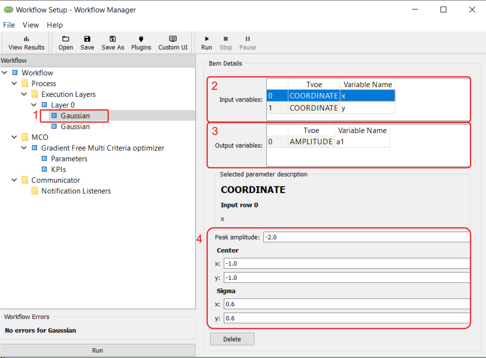
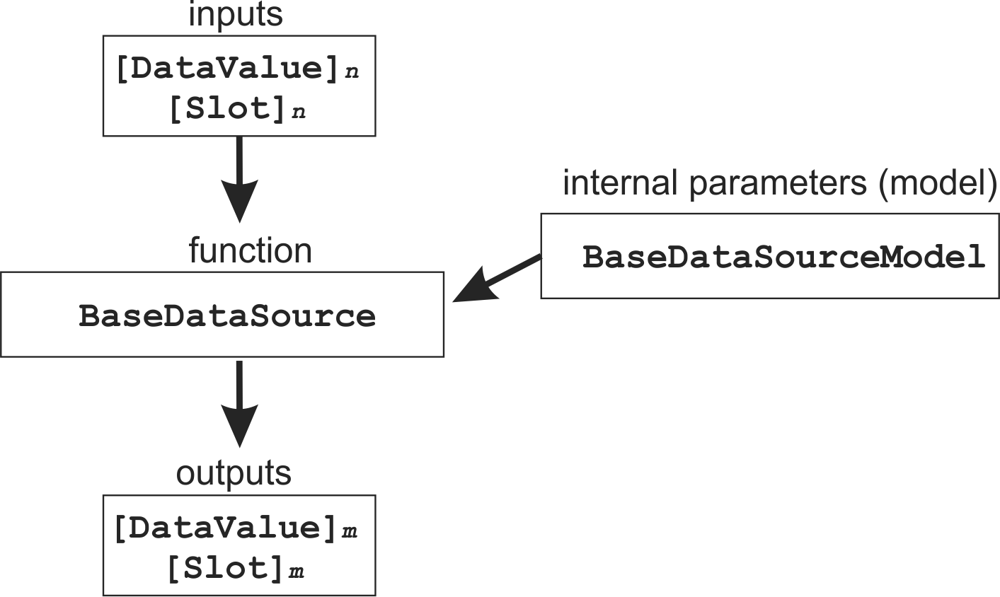
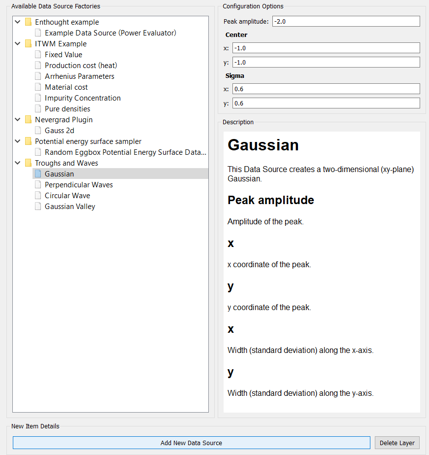

Data Source
===========

A data source is a node in the :ref:`workflow graph<wf-graph-ref>`.

In the Workflow Manager, when you click on a data source, you will see the node's:

1. **function**.
    The function that the node computes.

2. **inputs**.
    The function's parameters that can either be optimized (by selecting it as an
    MCO Parameter) or fed from the outputs of other nodes (by setting its ``variable name``
    to that of an output of another node).

3. **outputs**
    The function's returns that can be optimization criteria (by selecting it as an MCO KPI)
    and/or be passed to the inputs of other nodes (by setting its ``variable name`` to that of
    an input of another node).

4. **internal parameters** (**model**)
    The function's parameters that are 'internal' to the node (are not node inputs). They
    cannot be optimized but can be set by the user in the Workflow Manager. Think of them
    as the function's 'constants'.

These aspects of the node are represented by a set of ``class objects``:

We will illustrate how to design and use these objects, using the example
of the Gaussian data source, a two-dimensional Gaussian on the xy-plane:

.. math::
        a = a_{peak} \exp{\left[- \frac{(x - c_{x})^{2}}{2 \sigma_{x}^2} - \frac{(y - c_{y})^{2}}{2 \sigma_{y}^2}\right]}

The source code for this data source can be examined
`here <https://github.com/force-h2020/force-bdss-plugin-enthought-example>`_.

``DataValue``
-------------
The value of a node input or output. ``DataValue`` objects are passed between connected node's
during execution of the graph/workflow. Object attributes are:

``value``. The value of the input/output.

``type``. The type of the input/output.

``name``. The name of the input/output.

``Slot``
--------
The description of a node input or output. ``Slot`` objects are
#Object attributes are:

``description``

``type``

``BaseDataSource``
------------------
The node's function. ::

    class Gaussian(BaseDataSource):

        def run(self, model, parameters):
            x = parameters[0].value
            y = parameters[1].value

            a = ((x - model.cent_x)**2)/(2.0*model.sigm_x**2)
            a += ((y - model.cent_y)**2) / (2.0*model.sigm_y**2)
            a = model.peak * math.exp(-a)

            return [
                DataValue(value=a, type="AMPLITUDE"),
            ]

        def slots(self, model):
            return (
                (
                    Slot(description="x", type="COORDINATE"),
                    Slot(description="y", type="COORDINATE"),
                ),
                (
                    Slot(description="a", type="AMPLITUDE"),
                )
            )

The ``run`` method is the function itself. Its arguments are:

    ``model``
        The ``BaseDataSourceModel`` object that contains the function's 'internal' parameters
        or 'model'

    ``parameters``
        The list of ``DataValue`` objects with the values of the node's inputs, one element
        per input.

``run()`` returns the list of ``DataValue`` objects that are the node's outputs.

The ``slots`` method returns ``Slot`` objects corresponding to the node's inputs and outputs, in the
form of a tuple::

    ((<tuple of input slots>), (<tuple of output slots>))

The elements of ``(<tuple of input slots>)`` correspond to the elements of the ``parameters``
argument of ``run``. The elements of ``(<tuple of output slots>)`` correspond to the elements
of ``run``'s return.

``BaseDataSourceModel``
-----------------------
The node's 'internal' parameters ::

    class GaussianModel(BaseDataSourceModel):

        peak = Float(-2.0, label="Peak amplitude", desc="Amplitude of the peak.")
        cent_x = Float(-1.0, label="x", desc="x coordinate of the peak.")
        cent_y = Float(-1.0, label="y", desc="y coordinate of the peak.")
        sigm_x = Float(0.6, label="x", desc="Width (standard deviation) along the x-axis.")
        sigm_y = Float(0.6, label="y", desc="Width (standard deviation) along the y-axis.")

        traits_view = View(
            Item("peak"),
            Group(Item("cent_x"), Item("cent_y"), label="Center"),
            Group(Item("sigm_x"), Item("sigm_y"), label="Sigma")
        )

The ``label`` and ``desc`` attributes appear in the description of the data source
when it is selected from a plugin.

The ``View`` object determines how they are presented for editing in the Workflow Manager
(see above).

``BaseDataSourceFactory``
-------------------------
This is contributed to BDSS by the plugin and thus allows it to create instances of
``BaseDataSource`` and ``BaseDataSourceModel``. ::

    class GaussianFactory(BaseDataSourceFactory):
        def get_identifier(self):
            return "gaussian"

        def get_name(self):
            return "Gaussian"

        def get_description(self):
            return "This Data Source creates a two-dimensional " \
                   "(xy-plane) Gaussian."

        def get_model_class(self):
            return GaussianModel

        def get_data_source_class(self):
            return Gaussian

The returns of the ``get_name`` and ``get_description`` methods appear in the description
of the data source when it is selected from a plugin (see above).