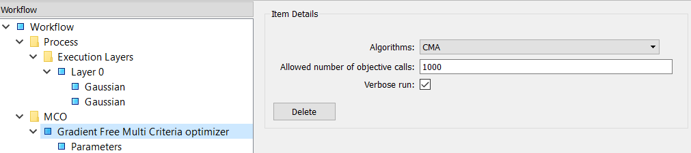
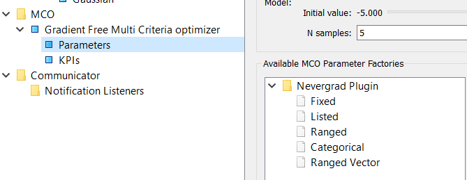

Optimizer
=========
The optimizer classes carry out the optimization of the workflow, the graph function. These
classes usually contain the acronym **MCO**, but there is no particular reason why your optimizer
should be a multi-criterion optimizer. In fact you could create optimizer classes that don't
even optimize at all: the core requirement of these classes is that they return a point or points
in :ref:`parameter space<optimization-ref>`, along with the associated criteria/KPIs/ojectives. These points *could be*
minima or Pareto-effecient, but could just as well be any kind of sampling: e.g. a grid or
random sample.

We will illustrate how to design and use these classes, using the example of the
Nevergrad optimizer that comes with the Nevergrad plugin. The source code for this
optimizer can be examined
`here <https://github.com/force-h2020/force-bdss-plugin-nevergrad/tree/master/force_nevergrad/mco>`_.

``BaseMCOModel``
----------------
The TraitsUI to the optimizer. ::

    class NevergradMCOModel(BaseMCOModel):

        #: Algorithms available to work with
        algorithms = Enum(
            *NevergradMultiOptimizer.class_traits()["algorithms"].handler.values
        )

        #: Defines the allowed number of objective calls
        budget = PositiveInt(100)

        #: Display the generated points at runtime
        verbose_run = Bool(True)

        def default_traits_view(self):
            return View(
                Item("algorithms"),
                Item("budget", label="Allowed number of objective calls"),
                Item("verbose_run"),
            )

It exposes a set of optimizer parameters with an associated ``View``.

``BaseMCO``
-----------
Creates a ``BaseOptimizerEngine`` object and runs that engine on the workflow. ::

    class NevergradMCO(BaseMCO):

        def run(self, evaluator):
            model = evaluator.mco_model

            optimizer = NevergradMultiOptimizer(
                algorithms=model.algorithms,
                kpis=model.kpis,
                budget=model.budget)

            engine = AposterioriOptimizerEngine(
                kpis=model.kpis,
                parameters=model.parameters,
                single_point_evaluator=evaluator,
                verbose_run=model.verbose_run,
                optimizer=optimizer
            )

            for index, (optimal_point, optimal_kpis) \
                    in enumerate(engine.optimize()):
                model.notify_progress_event(
                    [DataValue(value=v) for v in optimal_point],
                    [DataValue(value=v) for v in optimal_kpis],
                )

The ``run`` method takes a single argument - ``evaluator``: this is a ``Workflow`` object (the
name is ``evaluator``, because ``Workflow`` implements the ``IEvaluator`` interface). The
``evaluator`` ``Workflow`` object has the attribute ``mco_model``: this is the ``BaseMCOModel``
selected by the user (in our example ``NevergradMCOModel``).
Next ``run`` creates two objects:

``NevergradMultiOptimizer``
    An optimizer satisfying the ``IOptimizer`` interface.

``AposterioriOptimizerEngine``
    An optimizer engine, an implementation of ``BaseOptimizerEngine`` (see below)

By making a separate 'optimizer' and 'optimizer engine' we are making a subtle distinction between:

- the optimizer itself: the core optimization algorithm, and

- what we do with that optimizer: for instance find a Pareto efficient set by
  some :ref:`particular method<multicriteria-ref>` or track points on the way
  to a minima. This is the **engine**.

By separating these functions into different objects, we can mix-and-match optimizer and engine.
For instance in this example we use a Nevergrad optimizer and an engine that directs the optimizer
to find the Pareto efficient set by an :ref:`*a posteriori* method<multicriteria-ref>`.
However we could use an engine that uses the Nevergrad optimizer to find the set by an
:ref:`*a priori* method<multicriteria-ref>`.

It is not neccarsary to have a separate optimizer and engine: both functionalities can be bundled
into a single ``BaseOptimizerEngine`` object. Once this object is created ``run()`` calls its
``optimize`` iterator, which yields the results of the optimization.

The results yielded by ``BaseOptimizerEngine``'s ``optimize`` are wrapped into
``DataValue`` objects and then passed to the ``BaseMCOModel`` instance through its
``notify_progress_event`` method. This method has a concrete implementation in ``BaseMCOModel``
that takes the list of points and list of KPIs as arguments. However you can override this
method if you want to pass additional/different values to the model.

``BaseOptimizerEngine``
-----------------------
Does the actual optimization. ::

    class AposterioriOptimizerEngine(BaseOptimizerEngine):

        name = Str("APosteriori_Optimizer")

        optimizer = Instance(IOptimizer, transient=True)

        def optimize(self, *vargs):
            #: get pareto set
            for point in self.optimizer.optimize_function(
                    self._score,
                    self.parameters):
                kpis = self._score(point)
                yield point, kpis

As just mentioned the ``optimize`` iterator method of ``BaseOptimizerEngine``, yields the
optimization results. Each yield must consist of:

- ``point``
    A list of parameter (graph input) values. i.e. the point in :ref:`parameter space<optimization-ref>`.
- ``kpis``
    The criteria/objectives/KPI(s) at the point.

``optimize`` may yield just a single point (e.g. a minimum) or mutiple points (e.g. a Pareto set,
or grid sample).

In this example, ``optimize`` yields by calling another iterator: the ``optimize_function``
method of the ``IOptimizer`` instance. In our case this is the ``NevergradMultiOptimizer``
object we met earlier. However we won't go any further into this: as explained, the separation of
'optimizer' from 'engine' is optional. All one has to know is that the engine must have a
``optimize`` iterator method which yields a point in parameter space and the KPI(s) at that point.

``BaseMCOCommunicator``
-----------------------
The MCO Communicator must reimplement BaseMCOCommunicator and two methods:
``receive_from_mco()`` and ``send_to_mco()``. These two methods can use files,
stdin/stdout or any other trick to send and receive data between the MCO and
the BDSS running as a subprocess of the MCO to evaluate a single point.

``BaseMCOFactory``
------------------
This is contributed to BDSS by the plugin and thus allows it to create instances of
``BaseMCOModel``, ``BaseMCO`` and ``BaseMCOCommunicator``. ::

    class NevergradMCOFactory(BaseMCOFactory):

        def get_identifier(self):
            return "nevergrad_mco"

        def get_name(self):
            return "Gradient Free Multi Criteria optimizer"

        def get_model_class(self):
            return NevergradMCOModel

        def get_optimizer_class(self):
            return NevergradMCO

        def get_communicator_class(self):
            return BaseMCOCommunicator

        def get_parameter_factory_classes(self):
            return [
                FixedMCOParameterFactory,
                ListedMCOParameterFactory,
                RangedMCOParameterFactory,
                CategoricalMCOParameterFactory,
                RangedVectorMCOParameterFactory
            ]

Note that we do not use a ``BaseMCOCommunicator`` in this example, so just return the base class.

Also note the ``get_parameter_factory_classes`` method. This returns a list of parameterization
factories that suitable for the optimizer (see the last topic). These then appear in the
Workflow Manager, when selecting parameters.

