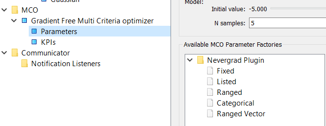

Parameterization
================

.. _parameterization-ref:

The workflow's parameters can be treated in different ways by the optimizer. A parameter might be
treated as a continuous variable (i.e. a real number) or a dis-continuous variable (e.g. an
integer) or a categorical variable (i.e. a member of a finite set) that may be ordered or
unordered. These different possibilities are the **parameterization** of the parameter. They
are important because certain optimizers can only deal with certain parameterizations. For
example gradient-based optimizers can only optimize continuous variables.

A parameterization requires just two classes - a ``BaseMCOParameter`` and its factory.
We will illustrate how to design and use these classes, using the example of the
'ranged' parameterization that comes built in with the BDSS. The source code for this
parameterization can be examined
`here <https://github.com/force-h2020/force-bdss/blob/master/force_bdss/mco/parameters/mco_parameters.py>`_.

``BaseMCOParameter``
--------------------
A parameterization. ::

    class RangedMCOParameter(BaseMCOParameter):

        #: Lower bound for parameter values range
        lower_bound = Float(0.1, verify=True)

        #: Upper bound for parameter values range
        upper_bound = Float(100.0, verify=True)

        #: Initial value. Defines the parameter bias
        initial_value = Float(verify=True)

        def _initial_value_default(self):
            return 0.5 * (self.lower_bound + self.upper_bound)

        def default_traits_view(self):
            return View(
                    ......
            )

        def verify(self):

            # .....

The class's traits are the properties of the parameterization: in this case for a continuous
variable (``Float``) with an initial value (``initial_value``) and a range (``lower_bound``
and ``upper_bound``).

The ``default_traits_view`` method provides a view to the Workflow Manager to control
the parameterization attributes.

The ``verify`` method is used to verify that a given parameter conforms with the
parameterization: in this example that it is within the bounds. The details are not important
and you might not want to even override the base method. Also any Trait that needs to
be verified in the UI when it is changed should set the verify=True metadata.

``BaseMCOParameterFactory``
---------------------------
Each ``BaseMCOParameter`` must be associated with a ``BaseMCOParameterFactory`` that returns
its class, description, etc. ::

    class RangedMCOParameterFactory(BaseMCOParameterFactory):
        """ Ranged Parameter factory"""

        def get_identifier(self):
            return "ranged"

        #: A name that will appear in the UI to identify this parameter.
        def get_name(self):
            return "Ranged"

        #: Definition of the associated model class.
        def get_model_class(self):
            return RangedMCOParameter

        #: A long description of the parameter
        def get_description(self):
            return "A parameter with a ranged level in floating point values."

Each optimizer factory (see next topic) must return a list of such
``BaseMCOParameterFactory`` s that correspond to parameterizations that it can handle. These
can then be selected from the list of ``Available MCO Parameter Factories``
in the Workflow Manager when creating the workflow's parameters.

