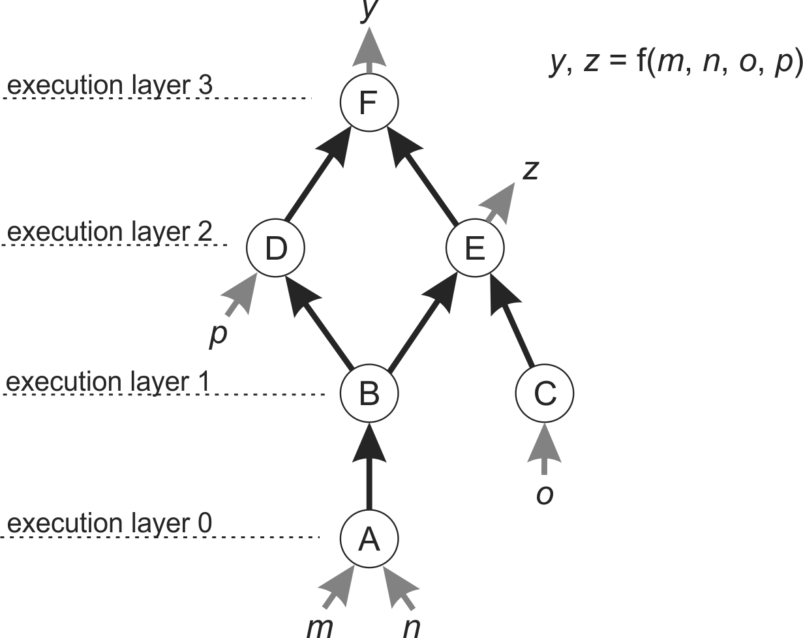

Optimization
============

.. _optimization-ref:

**Optimization** is the task of finding the set of **parameters** of a process that are "best" (**optimal**)
in terms of a set of **criteria**  or **objectives**. For instance a soap factory might be looking for
the optimal ratio of different fats and hydrolysis temperature (the inputs) that produce a soap
that has the best smell, the most suds and is cheap (the criteria/objectives).

Traditionally manufacturers have optimized their process at the R&D lab bench, before scaling-up
to the plant or factory. Optimization is guided, like any good experiment, by a mixture of
theoretical knowledge, expert intuition and brute-force: just trying as many parameter
combinations as possible in the time allowed. This is of course all very costly in terms
of time and money, so for a long time manufacturers have employed computational models of
their process.

Computational models are quick and cheap (at least relative to the bench), can themselves
use past experimental data and can simulate the at-scale process rather then a miniature
version. They will never supplant the bench, but they can reduce the leg-work. In industries
such as aerospace, computer models have been a vital element of R&D for decades. In the
materials and chemical industry, modelling is being driven by the increasing need for diverse,
exotic and tailored materials. How can one optimize a computer model of such a material's manufacture?
Formally one can describe the process to be optimized as a mathematical function. The function
has inputs (parameters) and outputs (objectives or criteria). The function itself is sometimes
called the **objective function**. The value of each input is an axis in parameter space. Each
point in **parameter space** is associated with a set of output/objective values. With two
parameters (x and y, say), a two-dimensional parameter space, the output (z) can be
visualised as a surface on the xy-plane with z as the height of the surface. For objective
functions with more than two inputs, the output surface is a **hypersurface** in a multi-dimensional
parameter space.

The definition of what is "optimal" depends on whether the objective function (process) has a
single output or multiple outputs (criterion).

Single-criterion optimization
~~~~~~~~~~~~~~~~~~~~~~~~~~~~~

A function with a single output is a **scalar function**. The maxima and minima and
are valley-bottoms and peaks of the output's surface, respectively. The **global**
minimum/maximum is the lowest/ highest valley-bottom/peak, respectively. Other
valley-bottoms/peaks are **local** minima/maxima. The task of optimization is then
to find at best the global minimum/maximum or at least a local minima/maxima.

Multi-criterion optimization
~~~~~~~~~~~~~~~~~~~~~~~~~~~~

.. _multicriteria-ref:

If the objective function has more than one output, there are multiple surfaces,
each with its own minima and maxima. At any point in parameter space, either:

- The slopes of the output surfaces all point in the same direction (all up or all down).
    One can always move away from that point and either increase all the
    outputs/criteria simultaneously or decrease all of them.

- The slopes of the output surfaces point in opposite directions.
    Making a move always increases at least one output whilst decreasing at least one
    of the others. These conditions are known as **Pareto dominated** and
    **Pareto efficient**, respectively,
    after the Italian engineer and economist Vilfredo Pareto. He said that the optimal
    situation is when we cannot improve all outcomes simultaneously  - that is
    a Pareto efficient point. The task of optimization is to find the set of
    Pareto efficient points. These points often form along a line through parameter space,
    the **Pareto front**.

Typically an industrial process will have multiple optimization criteria. Thus such
algorithms are vitally important but have rarely been used through a lack of
expertise and commonly available computational libraries or softwares that implement them.

Optimizing a Directed Graph
~~~~~~~~~~~~~~~~~~~~~~~~~~~

.. _wf-graph-ref:

Many processes can be divided up into granular, near-self-contained
**sub-processes**, with the output of one feeding into the input of another. For
instance a soap production line might be divided up into the melting of the fat,
the hydrolysis chamber, the mold cooling, milling and packing. It is often
helpful to reproduce these divisions when simulating a process with a computer.
Each sub-process is a function with inputs and outputs which feed one into
another. The functions might include molecular-dynamics or computational fluid
dynamics simulations, interpolation of experimental data or economic cost-price
calculations. The inputs and outputs might include concentrations of particular
chemicals, physical parameters such as temperature and pressure, price and
quality of materials or manufacture time.

There are many names for a set of connected sub-processes. The **pipeline** is
common in computer science, but has a clear industrial origin - reaction vessels
(sub-processes) connected by pipes. Another name is a **workflow**, with the clear
flavor of the office.  A mathematician would define it as a **directed graph**, with
the sub-processes as **nodes** and the connections as **edges**.

The entire graph/process of nodes/sub-processes/functions is itself
a single "super" function. Its inputs are all those node/sub-process/
function inputs that are not fed by an output (i.e. do not form an edge).
Its outputs are all the node/sub-process outputs (i.e. both those forming an
edge and not). The graph super-function can be optimized like any other.
Critically for this we must know how to execute the super-function.

The graph's nodes must be executed in a strict order, such that if the output
of node A forms the input of node B, then A must be executed before B. Nodes
with no edge between them, may be able to be executed in parallel, and so
form an **execution layer**. For graphs with a small number of nodes like
that below it is easy to figure out the execution layers manually. There are
**topological sort** algorithms which can calculate the execution order and
execution layers of a directed graph: for instance Kahn's algorithm and
depth-first search. In the BDSS the execution layers are set manually by the user.

    A graph with nodes A to F, inputs *m* to *p* and outputs *y* and *z*.

Many processes both man-made and in nature are cyclic. However a directed
graph of functions must be **acyclic** if it is to be optimized: a cyclic graph
will run forever.
