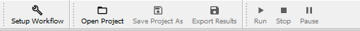
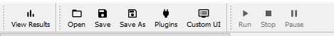

Views
=====

The Workflow Manager has two "views":

``Setup Workflow``
    For constructing the workflow, selecting parameters and KPIs and selecting
    an optimizer.

``View Results``
    For viewing the results of an optimization.

You can switch between the views with the top-left button in the tool-bar: the label
of this button will change accordingly.

