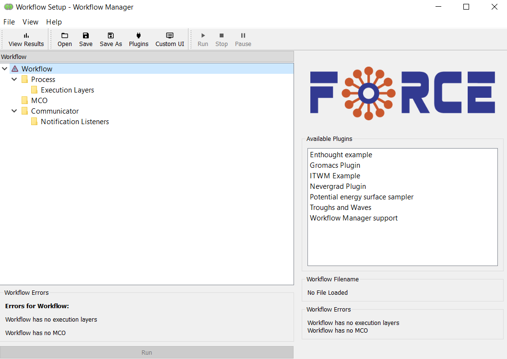
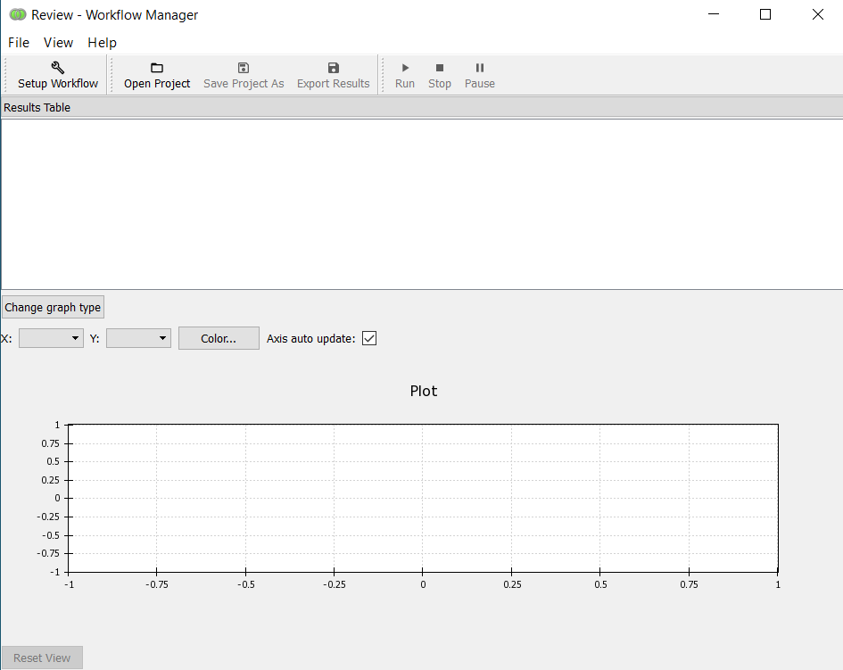

Starting the Workflow Manager
=============================

The Workflow Manager can be started from within the ``bootstrap`` environment with,

.. code-block:: console

    (bootstrap)$ edm run -e force-pyXX -- force_wfmanager

where force-pyXX is the :ref:`BDSS runtime environment <bdss-environment-ref>`.
Alternatively one can enter the runtime environment, e.g. ``force-py36``,

.. code-block:: console

    (bootstrap)$ edm shell -e force-py36

and then,

.. code-block:: console

    (force-py36)(bootstrap)$ force_wfmanager

Views
-----

The Workflow Manager has two major UI components or "views":

``Setup Workflow``
    For constructing the workflow, selecting parameters and KPIs and selecting
    an optimizer.

``View Results``
    For viewing the results of an optimization.

You can switch between the views with the top-left button in the tool-bar: the label
of this button will change accordingly. We will consider the two views, in turn, over the
next two topics.
