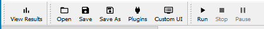
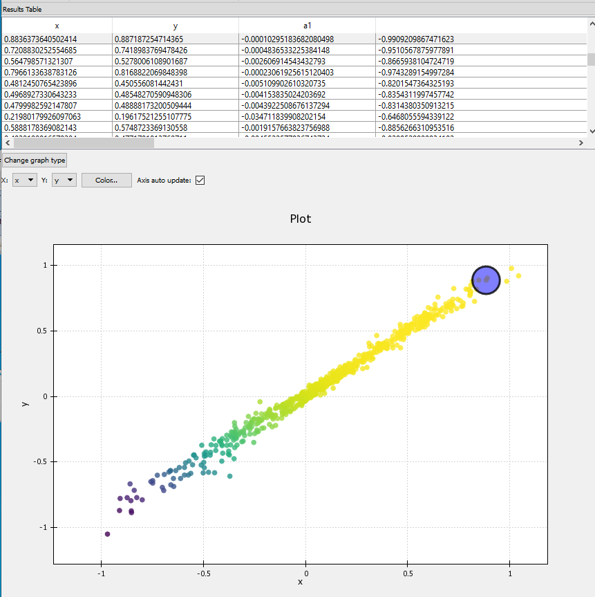

Run the Workflow
=================

You may have noticed that some of the tree-items had a warning-sign icon
next to them. These are to warn the user that something has not been set
correctly, such that the optimization will not run. A ``Workflow Errors``
field at the bottom-left of the window shows a message indicating the
error(s). Hopefully by now, after creating the workflow, selecting the
optimizer and setting the parameters, all the tree-items should be blue
squares, indicating that there are no errors. Now all that is left is
to run the optimization.

Below ``Workflow Errors`` is a ``Run`` button, which starts the optimization.
Alternatively you can press the ``Run`` button in the top tool-bar.

After pressing Run, a log window (command prompt) will appears on Windows,
that displays certain outputs of the optimization process as they occur.
This closes when the optimization has finished. Nothing appears on the Mac.

View the Results
----------------

Press the ``View Results`` button in the tool-bar. The ``View Results`` view,
contains two panels:

``Results Table``
    The values of the parameters and KPIs, in our case for each point
    in the Pareto-efficient set.

``Plot``
    A scatter plot of the points listed in the table. You can change the axis'
    of the plot from the drop-down lists and you can color code the points
    (according to KPI value, say) by pressing the ``Color`` button, which brings
    up a self-explanatory menu.

    The Pareto front for the two Gaussian data sources, calculated with the
    Nevergrad CMA algorithm. The front stretches between the peaks centered
    at (-1, -1) and (1, 1). The Pareto
    efficient points are color coded by the amplitude of the Gaussian
    centred at (-1, -1): both Gaussian's have negative amplitude (are
    minima) and cooler colors indicate lower values.

Saving the Workflow as a JSON file
----------------------------------

Once a workflow has been created and optimizer, parameters and
KPIs selected, you can save this as a json file that can be loaded
in future sessions. In the file menu select ``File > Save Workflow as``.
This brings up a file save dialog from which you can name and save
the json. When you wish to load the json, go to the ``Setup Workflow``
view, press ``Open`` in the tool-bar and select the json file. The entire
workflow, optimizer, parameters and KPIs will be loaded.
