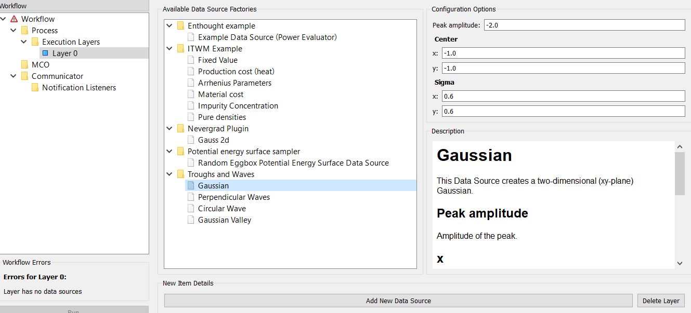

Setup the Workflow
==================

The left panel contains a tree view that displays the workflow, parameters
and KPIs and optimizer. Clicking on any item in the tree brings up fields
and buttons in the right panel for setting the selected attribute.

.. figure:: images/execution_layer.png
    :align: center

Below we will create one execution layer with two
`Gaussian data sources <https://github.com/force-h2020/force-bdss-plugin-enthought-example>`_.
Each data source describes a two-dimensional Gaussian on the
x-y plane.

.. math::
        a = a_{peak} \exp{\left[- \frac{(x - c_{x})^{2}}{2 \sigma_{x}^2} - \frac{(y - c_{y})^{2}}{2 \sigma_{y}^2}\right]}

With a negative peak amplitude (a :sub:`peak`) the Gaussian forms a minima in xy-parameter space.
With the amplitudes of two such Gaussians as the criteria/KPIs, the Pareto front stretches between
their two minima. We will find this front using an MCO built on top of
the `Nevergrad <https://github.com/facebookresearch/nevergrad>`_
gradient-free optimization library. This MCO is provided by a dedicated
`plugin <https://github.com/force-h2020/force-bdss-plugin-nevergrad>`_.

Create an Execution Layer
-------------------------

Select the ``Execution Layers`` tree-item and press the ``Add New Execution Layer``
button. A tree-item, ``Layer 0``, appears under ``Execution Layers``.

Add a Data Source
-----------------

Selecting the ``Layer 0`` tree-item brings up two panels at the right:

``Available Data Source Factories``
    A tree-list of all the available data sources, arranged by the
    plugin that has contributed them.

``Configuration Options/Description``
    A description of the data source.

Select one the ``Gaussian`` data sources contributed by the ``Troughs and Waves`` plugin
and press the ``Add New Data Source`` button to add it to the execution layer.

The data source is added as a tree-item under ``Layer 0``. Selecting this item
brings up four panels at the right:

- ``Input variables``
    The list of inputs.

- ``Output variables``
    The list of outputs.

- ``Selected parameter description``
    The description of the selected input/output.

- A ``list`` of constants that will not be optimized.

.. figure:: images/input_variables.png
    :align: center
    :scale: 60 %

The ``Variable Name`` fields of the ``Input variables`` and ``output variables`` are used to
connect data sources in different execution layers. Any output-input pair that you want to
connect as an edge, should be given the same ``Variable Name``.
Otherwise you can enter anything you like: it is easiest to use
the name that appears in ``Selected parameter description``. This is
what we will do for the Gaussian data source, as we are not
connecting it to another data source (both Gaussian data sources will be in
the same execution layer).

Add a second Gaussian data source to the same execution layer. The list of constants for
the Gaussian data source are:

- the peak amplitude

- position of the peak (``Center`` x and y coordinates)

- width of the peak (standard deviation or ``Sigma`` along the x and y axis)

Center the Gaussians at (-1, 1) and (1, 1) with amplitudes of -2 and -1, respectively. The
first Gaussian is then global minimum whereas the second is a local minimum.

.. figure:: images/input_variables_g2.png
    :align: center
    :scale: 60 %

Their ``Input variable`` names should be the same (e.g. ``x`` and ``y``), so that they
refer to the same x and y parameters.

Their ``Output variable`` names (their amplitudes) should be different (e.g. ``a1`` and ``a2``),
so that they are recognised as separate KPIs.

Select an Optimizer
-------------------

Selecting the ``MCO`` tree-item brings up two panels at the right:

``Available MCO Factories``
    A tree-list of all the available optimizers, arranged by the plugin that has contributed them. Note that not all of these will be multi-criterion optimizers.

``Configuration Options/Description``
    A description of the selected optimizer.

Select an optimizer and press the ``Add New MCO`` button. The optimizer is added as a tree-item
under ``MCO``. Selecting this item brings up a single panel to the right:

``Item Details``
    Certain parameters that control how the optimizer works.

Select ``CMA`` for the ``algorithm`` and set 1000 for ``Allowed number of objective calls``.

.. figure:: images/mco_algo.png
    :align: center
    :scale: 60 %

Select the Parameters
---------------------

Under the optimizer are two further tree-items for setting the parameters and KPIs.

Selecting the ``Parameters`` tree-item brings up two panels at the right:

``Available MCO Parameter Factories``
    A tree-list of all the available parameters for the optimizer.

``Description``
    The description of the selected parameter.

When we specify a "parameter", as well as selecting a data source input we must also
tell the optimizer how to treat that input: its ** :ref:`parameterization <parameterization-ref>` **.
Is the parameter:

- fixed (i.e. a constant)?

- continuous, with a lower and upper bound?

- categorical, a member of an ordered or unordered set?

Certain optimizers can only handle certain parameterizations. For
instance, gradient-based optimizers can only handle continuous
parameters, not categorical (which don't have a gradient). The
Nevergrad optimizer can handle all types, but for now we will
only use continuous ('Ranged').

Select the ``Ranged`` item and press the ``New Parameter`` button. A new
panel appears at the top-right. This will contain a tab for each
parameter added. A ``Ranged`` parameter tab has the following fields:

``Name``
    A drop-down list of data source inputs. Select the input "x", the x coordinate.

``Lower bound``
    Set the lower bound to -5.

``Upper bound``
    Set the lower bound to 5.

``Initial value``
    Slide this to anything (it doesn't matter to the Nevergrad optimizer).

``N samples``
    This has no meaning and can be ignored.

Add another ``Ranged`` parameter for the y coordinate and set the same
bounds and initial value.

Select the KPIs
---------------

Selecting the ``KPIs`` tree-item brings up a ``New KPI button``. Pressing
this button brings up a tabbed pane, one tab for each KPI added
with the following fields:

``Name``
    A drop-down list of data-source outputs. Select the output "a1", the
    amplitude of the first Gaussian data source.

``Objective``
    Choose whether to minimize or maximize the KPI. With maximize chosen,
    the KPIs are simply negated during optimization. In our case choose
    minimize as the Gaussians have negative peak amplitude. If you make
    the Gaussian peaks positive and then choose maximize: this will give
    you the same results.

``Auto scale``
    This is used by some of the optimizers to scale the KPIs so that they
    have comparable amplitudes. The Nevergrad optimizer does not scale,
    so ignore this.

Add a KPI for the second Gaussian ("a2") in the same manner.

